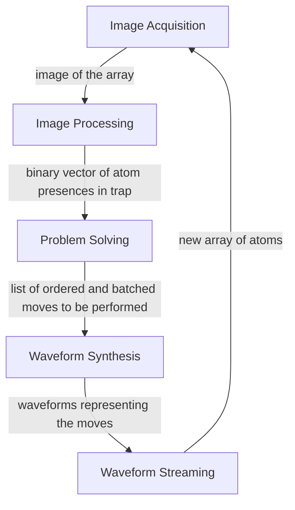
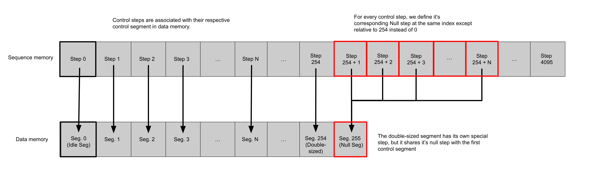
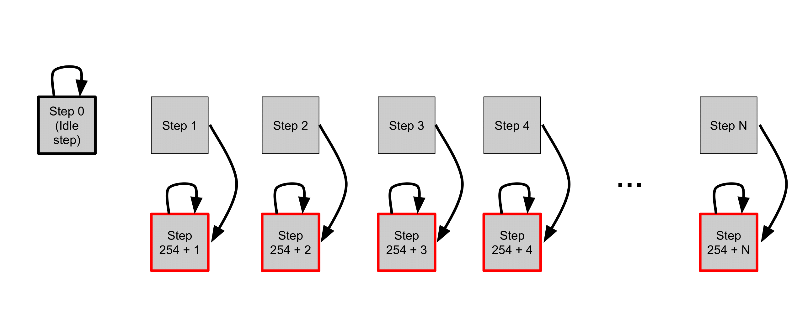
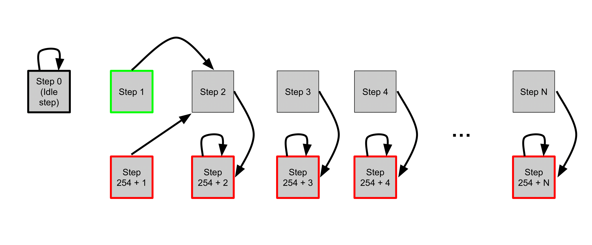
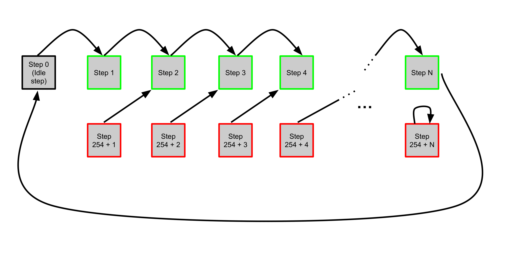
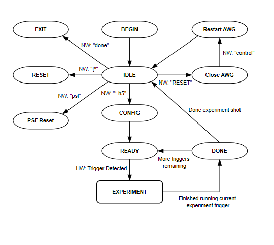

# LLRS
The low-latency reconfiguration system (LLRS) is a closed-loop feedback control system that arranges and reconfigures atoms within an array of laser traps.

## Status

### Driver Releases
[](https://github.com/TQT-RAAQS/LLRS/actions/workflows/awg_fetch.yml)  [](https://github.com/TQT-RAAQS/LLRS/actions/workflows/fgc_fetch.yml)   [](https://github.com/TQT-RAAQS/LLRS/actions/workflows/emccd_fetch.yml)


## System Outline 

The LLRS contains five submodules:

Each of these submodules is defined in [`modules/llrs-lib/modules`](https://github.com/TQT-RAAQS/LLRS/tree/main/modules/llrs-lib/modules).

## Requisites 
 
- GCC | [Installation Guide](https://gcc.gnu.org/install/)
 
- NVCC CUDA Compiler | [Installation Guide](https://docs.nvidia.com/cuda/cuda-installation-guide-linux/index.html)
 
- Nvidia CUDA Toolkit | [Installation Guide](https://developer.nvidia.com/cuda-downloads)
 
- Python3 (Version 3.8 or newer) | [Installation Guide](https://wiki.python.org/moin/BeginnersGuide/Download)
 
- Meson Build System | [Installation Guide](https://mesonbuild.com/Getting-meson.html)
 
- Jupyter Notebook (only required for benchmarking) | [Installation Guide](https://jupyter.org/install)
 
## LLRS Directory 

```
LLRS
├─ .gitignore
├─ README.md
├─ LICENSE 
├─ resources
├─ configs
│  ├─ llrs 
│  ├─ operational-benchmarking 
│  ├─ runtime-benchmarking 
│  ├─ awg
│  ├─ emccd 
│  └─ fgc 
├─ tools
│  ├─ setup-emccd.ipynb
│  ├─ generate-fake-psf.py 
│  ├─ psf-translator.py 
│  └─ benchmarks 
│     ├─ operational-benchmarking 
│     └─ runtime-benchmarking 
└─ modules
    ├─ awg    [External Dependency]
    ├─ camera [External Dependency]
    ├─ fgc    [External Dependency] 
    ├─ llrs-lib
    │  ├─ image-acquisition
    │  ├─ image-processing
    │  ├─ reconfiguration
    │  ├─ solver 
    │  ├─ waveform-synthesis
    │  ├─ waveform-streaming
    │  ├─ setup 
    │  ├─ collector 
    │  ├─ utility 
    │  └─ jsonwrapper 
    ├─ llcs 
    │  ├─ fsm 
    │  ├─ h5-wrapper 
    │  ├─ server 
    │  ├─ state 
    │  └─ trigger-detector 
    ├─ llrs-exe 
    ├─ operational-benchmarking
    └─ runtime-benchmarking
```


## Operating the LLRS

### Build the LLRS 
- Clone the repo on your local machine.
- In the terminal, execute the command `meson setup bin` in the LLRS directory.
- Navigate into the bin directory using `cd bin`.
- Execute `meson compile` to compile the LLRS.

###  Configure and Setup the Experiment 
There are several Yaml files stored in the `configs` directory which allow for configuration of the AWG, EMCCD camera, and FGC hardware settings.
There is also a configuration file for the LLRS which allows the user to define the problem for the LLRS to execute. Note that this configuration file includes fields for a PSF filename (`psf`) as well as CSV filenames (`coef_x` and `coef_y`) containing the alpha, nu, phi values of the AODs creating the trap array. These files must be generated by the user before the LLRS can run. 

The following configuration files must be stored in the following directories:
- PSF files must be stored in the `LLRS/resources/PSF/` 
- CSV files must be stored in the `LLRS/resources/coef/primary/` directory for `coef_x` and `LLRS/resources/coef/secondary/` directory for `coef_y`.
  
Note: The LLRS is set up to search the proper subdirectories for necessary support files. All resource files must be stored at the appropriate subdirectory, and only the file name must be provided in the field, not the full file path. 

### Run Experiment 
Run the LLRS executable placed at `bin/modules/llrs-exe/llrs-exe`. 
This causes the LLRS to begin waiting for an AWG trigger (jump from segment 0 to 1). The LLRS will wait for 60 seconds for a trigger, after which it will halt. Upon receiving an AWG trigger, the reconfiguration will execute. Following the termination of the program, it will output the success rate of the experiment.  


## Peripherals

### AWG
The Arbitrary Waveform Generator (AWG) is a versatile electronic instrument designed to produce various types of waveforms for use in a wide range of applications, such as signal testing, circuit testing, or trap manipulation and movement. 

In the context of the LLRS, the AWG is responsible for loading and streaming waveforms corresponding to the moves that are produced by the problem solving algorithms. 

The source code files and driver code for the AWG can be found in the github repository at [LLRS/modules/awg](https://github.com/TQT-RAAQS/LLRS/tree/main/modules/awg).

The Spectrum Hardware Manual and Software Driver Manual for can be found at the following link.
[AWG Manual](https://uofwaterloo-my.sharepoint.com/:b:/r/personal/acooperr_uwaterloo_ca/Documents/TQT-RAAQS/Projects%20(URAs)/Caltech/Scripts/createUniformTweezers/2018-05-10%20Create%20uniform%20arrays/createTweezers/SpcmMatlabDriver/m4i_m4x_66xx_manual_english.pdf?csf=1&web=1&e=6Qa8B3)


#### Loading and Streaming 
The AWG features sequence memory and data memory.
The data memory is the installed on-board memory of the card and can be segmented into a user defined number of segments. The data memory is responsible for storing the waveforms, and we define each segment of the data memory to be 32 waveforms in length. 
The sequence memory defines a number of data loop steps that are executed step by step. Each step in the sequence memory contains a pointer to a segment of data memory which is to be played, a number indicating how many times to play that data memory segment, and a pointer to the next loop step in sequence memory to proceed to when the current step is done.

<p align="center">
  
</p>

For the LLRS the AWG performs concurrent loading and streaming of waveforms in order to minimize the time of execution for the LLRS. Two segments of waveforms are loaded into the data memory and then the sequence memory begins, executing the streaming of waveforms from the data memory as further segments of the memory are loadedd concurrently.
The initial step of sequence memory is referred to as the idle step, and is entered when the AWG recieves a trigger indicating that the LLRS is beginning execution. The idle step points to itself as the next step, and thus it loops on itself while the inital loading of the data memory occurs. The sequence memory is partitioned into pairs with each step pointing to a corresponding null step which is located in the back half of the sequence memory and points to the null segment in data memory. As the data memory is loaded with waveforms, the sequence memory is altered so that each step points to the next one instead of its corresponding null. This is done to ensure that if playback of sequence memory ever outpaces and catches up to the loading of sequence memory, then nulls are reached by the playback head instead of empty data memory. 

The following diagrams show the sequence memory of the AWG for initialization, single segment of uploaded waveforms, and final segment of uploaded waveforms respectively.

<p align="center">
  
</p>

<p align="center">
  
</p>

<p align="center">
  
</p>


### FGC
The frame grabber card is a hardware device used in image processing and computer vision applications. It's designed to capture video frames from analog or digital video sources and convert them into digital format for further processing or storage on a computer.

The source code files and driver code for the FGC can be found in the github repository at [LLRS/modules/fgc](https://github.com/TQT-RAAQS/LLRS/tree/main/modules/fgc).

The FGC used by the LLRS is the FireBird Stick, a specific model offered by Active Silicon and its various manuals can be accessed at the following links.

[FireBird System Manual](https://uofwaterloo-my.sharepoint.com/personal/acooperr_uwaterloo_ca/_layouts/15/onedrive.aspx?id=%2Fpersonal%2Facooperr%5Fuwaterloo%5Fca%2FDocuments%2FTQT%2DRAAQS%2FProjects%20%28URAs%29%2FEMCCD%20workstation%20%28Sailesh%29%2FActiveSDK%20v01%2E08%2E02%2Fdocumentation%2FFireBird%5FSystem%5FManual%2Epdf&parent=%2Fpersonal%2Facooperr%5Fuwaterloo%5Fca%2FDocuments%2FTQT%2DRAAQS%2FProjects%20%28URAs%29%2FEMCCD%20workstation%20%28Sailesh%29%2FActiveSDK%20v01%2E08%2E02%2Fdocumentation)

[PHX API Manual (Driver)](https://uofwaterloo-my.sharepoint.com/personal/acooperr_uwaterloo_ca/_layouts/15/onedrive.aspx?id=%2Fpersonal%2Facooperr%5Fuwaterloo%5Fca%2FDocuments%2FTQT%2DRAAQS%2FProjects%20%28URAs%29%2FEMCCD%20workstation%20%28Sailesh%29%2FActiveSDK%20v01%2E08%2E02%2Fdocumentation%2FPHX%5FAPI%5FManual%2Epdf&parent=%2Fpersonal%2Facooperr%5Fuwaterloo%5Fca%2FDocuments%2FTQT%2DRAAQS%2FProjects%20%28URAs%29%2FEMCCD%20workstation%20%28Sailesh%29%2FActiveSDK%20v01%2E08%2E02%2Fdocumentation)%         

### EMCCD
An EMCCD (Electron Multiplying Charge-Coupled Device) camera is a type of digital camera specifically designed for low-light imaging applications where high sensitivity and high-speed imaging are required. It is particularly useful in scientific research, microscopy, astronomy, and fluorescence imaging where capturing faint signals is crucial. The LLRS uses an EMCCD to take pictures of the trap array in order to identify which traps have atoms present.

The source code files and driver code for the EMCCD can be found in the github repository at [LLRS/modules/camera](https://github.com/TQT-RAAQS/LLRS/tree/main/modules/camera).


The model of EMCCD that is used by the LLRS is the Andor iXon Ultra 888. 
[Andor iXon Ultra 888 Hardware Manual](https://uofwaterloo-my.sharepoint.com/personal/acooperr_uwaterloo_ca/_layouts/15/onedrive.aspx?FolderCTID=0x0120004EEB1D30D2CDC344930DD3804F50A548&id=%2Fpersonal%2Facooperr%5Fuwaterloo%5Fca%2FDocuments%2FTQT%2DRAAQS%2FInstruments%2FCameras%2FAndor%20iXon%20Ultra%20888%2FiXon%20Ultra%20888%20Hardware%20Guide%201%2E0%2Epdf&parent=%2Fpersonal%2Facooperr%5Fuwaterloo%5Fca%2FDocuments%2FTQT%2DRAAQS%2FInstruments%2FCameras%2FAndor%20iXon%20Ultra%20888)

[Software Developement Kit](https://uofwaterloo-my.sharepoint.com/personal/acooperr_uwaterloo_ca/_layouts/15/onedrive.aspx?FolderCTID=0x0120004EEB1D30D2CDC344930DD3804F50A548&id=%2Fpersonal%2Facooperr%5Fuwaterloo%5Fca%2FDocuments%2FTQT%2DRAAQS%2FInstruments%2FCameras%2FAndor%20iXon%20Ultra%20888%2FSoftware%20Development%20Kit%2Epdf&parent=%2Fpersonal%2Facooperr%5Fuwaterloo%5Fca%2FDocuments%2FTQT%2DRAAQS%2FInstruments%2FCameras%2FAndor%20iXon%20Ultra%20888)

The sensor that is present in the EMCCD is the CCD201-20.
[EMCCD Sensor Data Sheet](https://uofwaterloo-my.sharepoint.com/personal/acooperr_uwaterloo_ca/_layouts/15/onedrive.aspx?FolderCTID=0x0120004EEB1D30D2CDC344930DD3804F50A548&id=%2Fpersonal%2Facooperr%5Fuwaterloo%5Fca%2FDocuments%2FTQT%2DRAAQS%2FInstruments%2FCameras%2FAndor%20iXon%20Ultra%20888%2FCCD201%2D20%20Sensor%20Data%20Sheet%2Epdf&parent=%2Fpersonal%2Facooperr%5Fuwaterloo%5Fca%2FDocuments%2FTQT%2DRAAQS%2FInstruments%2FCameras%2FAndor%20iXon%20Ultra%20888)


## LLRS Integeration Tools

### LLRS-Executable

The LLRS-exe is a simple system for running the LLRS. After the setup phase, the system will continuously poll the current segment pointed to by the AWG. To run the LLRS, the AWG must point to segment 1, then the LLRS will be executed. Following this, the AWG will point to segment 0 and the polling loop continues.


### Low Latency Control System (LLCS)
The Low-Latency Control System is the system responsible for running the LLRS experiment shots. The LLCS connects to the workstation via a ZMQ server and communicates through the server to configure hardware, program the experimental shot sequence, and to return relevant experimental metadata. 

#### General Workflow:

<p align="center">
  
</p>


```BEGIN```: Connects to hardware, configures LLRS with initial configuration, and streams static waveforms

```IDLE```: Waits for server requests

```RESET```: Reconfigures LLRS, returns to IDLE upon completion

```PSF_RESET```: Updates PSF file, returns to IDLE upon completion

```Close AWG```: LLCS gives up control of the AWG

```Restart AWG```: LLCS retakes control of the AWG, returns to IDLE upon completion

```CONFIG```: Configures experiment (hardware and experimental shot sequence), transitions to READY upon completion

```READY```: Awaits hardware trigger to begin the configured experiment sequence

```Experiment Sequence```: Executes the series of experiment modules. Transitions to DONE upon finishing the current experiment trigger
 
```DONE```: Saves relevant metadata to a JSON file. If there are more triggers remaining in the shot, transition to READY, otherwise transition to IDLE.

```EXIT```: Exits the LLCS


#### Usage Instructions:

1. Build the project. 

2. Run the LLCS place at `bin/modules/llcs/llcs`.


3. Wait for the message "LLCS:: IDLE state". In the IDLE state you can send 5 server requests.

 ```*.h5```<p></p>
        - The request string can be an h5 filepath containing the configuration data <p></p>
        - Configures the AWG, "easy to configure" properties of the LLRS, and the experimental shot sequence<p></p>
        - Automatically transitions to the READY state upon completion

 ```RESET```<p></p>
        - Closes connection to the LLCS for another device to take over<p></p>
        - Waits for the "control" request from the server to retake control over the AWG<p></p>
        - IMPORTANT: The user must follow up with sending "control" before proceeding with any other LLCS actions<p></p>
        - Automatically transition back to IDLE

  ```psf```<p></p>
        - Runs the psf_translator python script, which updates psf file<p></p>
        - Automatically transitions back to the IDLE state<p></p>
        - IMPORTANT: The user should send a .h5 filepath when the LLCS is back in IDLE in order to update the LLRS with the new psf file

 ```{ *```<p></p>
        - The request string is the contents of a JSON file containing the LLRS configuration file, beginning with "{"<p></p>
        - Reconfigures the LLRS and it's waveform table with the new configuration<p></p>
        - This will take a few minutes to complete, and will automatically transition to IDLE upon completion

```send_data```<p></p>
        - Return a filepath to the workstation for the metadata file of the most recent shot
    
 ```done```<p></p>
        - The LLCS program will terminate gracefully


4. After sending a .h5 filepath while in the IDLE state, the LLCS will transition to READY. Wait for the message "Awaiting Hardware Trigger...". The user must send a hardware trigger via the workstation to run each experiment sequence. This message will reappear every time there are more triggers left in the experimental shot. 

5. After the experimental shot is completed, the LLCS will transition back to IDLE. Repeat steps 4-5.

