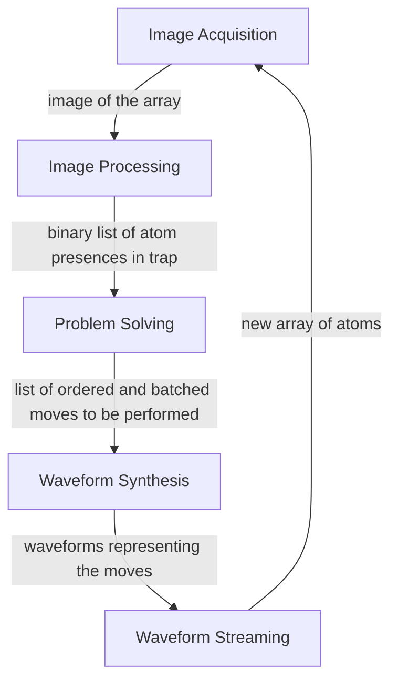

# LLRS
The low-latency reconfiguration system (LLRS) is a closed-loop feedback control system that arranges and reconfigures atoms within an array of laser traps

The LLRS contains five submodules:

Each of these submodules are defined in `src-components/LLRS-lib/`.

## Resources ##
***Software***
- System Source:  [NVCC C++/CUDA](https://docs.nvidia.com/cuda/cuda-compiler-driver-nvcc/)
- Operational Simulation: [Python3.8](https://www.python.org/downloads/release/python-380/)  

***Hardware***
- Andor EMCCD Camera [SDK](https://uofwaterloo-my.sharepoint.com/:b:/r/personal/acooperr_uwaterloo_ca/Documents/TQT-RAAQS/Instruments/Cameras/Andor%20iXon%20Ultra%20888/Software%20Development%20Kit.pdf?csf=1&web=1&e=PwVsGD) and [Hardware Guide](https://uofwaterloo-my.sharepoint.com/:b:/r/personal/acooperr_uwaterloo_ca/Documents/TQT-RAAQS/Instruments/Cameras/Andor%20iXon%20Ultra%20888/iXon%20Ultra%20888%20Hardware%20Guide%201.0.pdf?csf=1&web=1&e=1YGfOq)
- Active Sillicon FireBird Frame Grabber Card [API manual](https://uofwaterloo-my.sharepoint.com/:b:/r/personal/acooperr_uwaterloo_ca/Documents/TQT-RAAQS/Instruments/Frame%20Grabber%20Card/PCIe%20ActiveSilicon%20Firebird%20CameraLinkCard/documentation/PHX_API_Manual.pdf?csf=1&web=1&e=8Pmdny) and [CUDA Driver](https://uofwaterloo-my.sharepoint.com/:b:/r/personal/acooperr_uwaterloo_ca/Documents/TQT-RAAQS/Instruments/Frame%20Grabber%20Card/PCIe%20ActiveSilicon%20Firebird%20CameraLinkCard/documentation/CUDA_Driver_API.pdf?csf=1&web=1&e=Q3j8rk)
- Spectrum M4 Abitrary Waveform Generator [Manual](https://uofwaterloo-my.sharepoint.com/:b:/r/personal/acooperr_uwaterloo_ca/Documents/TQT-RAAQS/Instruments/AWG/Spectrum%20M4i6622-x8/docs/m4i_m4x_66xx_manual_english.pdf?csf=1&web=1&e=vYy5b9)

## Directory ##

```
LLRS
├─ .gitignore
├─ README.md
├─ LICENSE 
├─ resources
├─ configs
│   └─ hardware-drivers
│      ├─ AWG
│      └─ FGC
├─ tools
├─ benchmarks
│  ├─ operational-benchmarking
│  └─ runtime-benchmarking
└─ src-components
    ├─ hardware-drivers
    │  ├─ AWG
    │  └─ FGC
    ├─ LLRS-lib
    │  ├─ image-acquisition
    │  ├─ image-processing
    │  ├─ reconfiguration
    │  ├─ waveform-synthesis
    │  ├─ waveform-streaming
    │  ├─ setup 
    │  └─ library
    ├─ LLRS-server
    │  ├─ [PLACEHOLDER]
    │  └─ [PLACEHOLDER]
    ├─ LLRS-exe
    │  ├─ [PLACEHOLDER]
    │  └─ [PLACEHOLDER]
    ├─ utils
    │  ├─ [PLACEHOLDER]
    │  └─ [PLACEHOLDER]
    ├─ tests
    │  ├─ [PLACEHOLDER]
    │  └─ [PLACEHOLDER]
    ├─ benchmarks
    │  ├─ [PLACEHOLDER]
    │  └─ [PLACEHOLDER]
    └─ README.md
```
