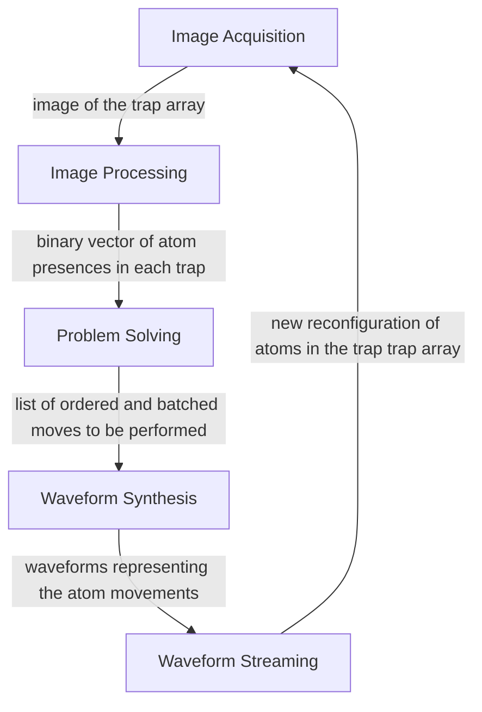

# LLRS
The Low-Latency Reconfiguration System (LLRS) is a closed-loop feedback control system that arranges and reconfigures atoms within an array of laser traps.

## System Outline 

The LLRS contains five submodules:

Each of these submodules is defined in [`modules/llrs-lib/modules`](https://github.com/TQT-RAAQS/LLRS/tree/main/modules/llrs-lib/modules).

## LLRS Directory 

```
LLRS
├─ .gitignore
├─ README.md
├─ LICENSE 
├─ resources
├─ configs
│  ├─ llrs 
│  ├─ awg
│  ├─ emccd 
│  ├─ fgc 
│  ├─ waveforms
│  ├─ waveform-power-safety
│  ├─ runtime-benchmarking 
│  └─ operational-benchmarking
├─ tools
│  ├─ setup-emccd.ipynb
│  ├─ generate-fake-psf.py 
│  ├─ psf-translator.py 
│  ├─ algorithm-animation-generator.ipynb
│  └─ benchmarks 
│     ├─ operational-benchmarking.ipynb
│     ├─ runtime-benchmarking.ipynb
│     ├─ image-acquisition-characterization.ipynb 
│     ├─ image-processing-characterization.ipynb 
│     └─ wfm-streaming-characterization.ipynb
└─ modules
    ├─ awg    [External Dependency]
    ├─ fgc    [External Dependency] 
    ├─ llrs-lib
    │  ├─ image-acquisition
    │  ├─ image-processing
    │  ├─ reconfiguration
    │  ├─ solver 
    │  ├─ waveform-synthesis
    │  ├─ waveform-streaming
    │  ├─ setup 
    │  ├─ collector 
    │  ├─ utility 
    │  └─ jsonwrapper 
    ├─ llcs 
    ├─ llrs-exe 
    ├─ operational-benchmarking
    ├─ runtime-benchmarking
    ├─ waveform-loader 
    ├─ hdf5-wrapper 
    ├─ movement-generator 
    └─ zmq-server 
```


## Installation & Setup

## Hardware Requirements

The LLRS requires the PC with the following hardware specifications to operate:

### Processors
- x86 64-bit CPU 
- Nvidia GPU with CUDA support
### Operating System
- Unix-based OS (Developed and tested on Ubuntu 18.04 LTS)  
### Peripherals
- Frame Grabber Card (FGC)
The Frame Grabber Card must be installed on a PCIe slot and connected to the EMCCD camera via a Camera Link cable. Additionally, the camera must be connected via a trigger cable to the AWG trigger port for image triggering.

- Arbitrary Waveform Generator (AWG)
The Arbitrary Waveform Generator card must be installed on a PCIe slot and its channels be connected to the AODs via a BNC cable.


## Software Requirements

Before usage, the following software must be installed and compiled to have a LLRS executable:

### Requirements

- GCC | The C++ compiler that is used to compile LLRS. Pre-installed on most GNU/Linux distro. | [Installation Guide](https://gcc.gnu.org/install/)
 
- NVCC CUDA Compiler | The Cuda compiler that is used to compile the LLRS. Requires a CUDA-enabled Nvidia GPU.| [Installation Guide](https://docs.nvidia.com/cuda/cuda-installation-guide-linux/index.html)
 
- Nvidia CUDA Toolkit | The CUDA library is used only for the GPU features of the LLRS. | [Installation Guide](https://developer.nvidia.com/cuda-downloads)
 
- Meson Build System | The build system used to compile the project. | [Installation Guide](https://mesonbuild.com/Getting-meson.html)

- Python3 (Version 3.8 or newer) | Only required for benchmarking. | [Installation Guide](https://wiki.python.org/moin/BeginnersGuide/Download)
 
- Jupyter Notebook | Only required for benchmarking. | [Installation Guide](https://jupyter.org/install)
 
### Peripheral Drivers

- FGC
The LLRS uses ActiveSilicon FireBird Stick FGC and hence requires the installation of the ActiveSilicon SDK. It can be obtained from [ActiveSilicon](https://www.activesilicon.com/products/ActiveSDK-software-development-kit/), and must be then installed on the system. LLRS' build system will look for the SDK in the default installation path at `/usr/local/activesilicon`, but this can be changed in the corresponding [Meson file](modules/fgc/ActiveSDKv01.08.02/meson.build).

- AWG 
Similar to the FGC, the LLRS uses Spectrum Instrumentation's AWG cards and hence requires the installation of the Spectrum Instrumentation driver and SDKs. They can be obtained from [Spectrum Instrumentation](https://spectrum-instrumentation.com/support/knowledgebase/software/How_to_compile_the_Linux_Kernel_Driver.php), and must be then installed on the system. LLRS' build system will look for the Spectrum library in the default installation paths.

- EMCCD

Although the LLRS doesn't directly interact with the EMCCD, the EMCCD is required to be set up and waiting for hardware triggers before running the LLRS. The exact drivers and function calls that are necessary for this depends on your camera's make and model. An example for such a procedure using the Andor's Python SDKs for the Andor iXon Ultra 888 can be found in the `tools/setup-emccd.ipynb` notebook.

### Build the LLRS
To compile the LLRS, follow these steps:
- Clone the repo on your local machine and navigate to the LLRS directory.
- In the terminal, execute the command `meson setup bin` in the LLRS directory.
- Navigate into the bin directory using `cd bin`.
- Execute `meson compile` to compile the LLRS.
- The compiled libraries and executables can be found under the `bin/modules` directory.

## Usage
LLRS requires multiple experiment-specific configurations and resources in order to run:

### Resources 
- PSF -- TO BE FILLED --

PSF files must be stored in the `LLRS/resources/PSF/` 

- Coefficients -- TO BE FILLED --

CSV files must be stored in the `LLRS/resources/coef/primary/` directory for `coef_x` and `LLRS/resources/coef/secondary/` directory for `coef_y`.

### Configurations

- Waveforms
The waveforms corresponding to the movement along the traps can be configured at `configs/waveforms/config.yml`. A more detailed explanation of the configuration parameters can be found in the Waveform Synthesis' [README file](modules/llrs-lib/modules/waveform-synthesis/README.md).

- AWG
The AWG configuration can be found at `configs/awg/awg.yml`. This file contains the configuration for the AWG-related parameters, e.g., the nominal peak-to-peak voltage, the sampling rate, and the number of segments.

- AWG Power Calculator 

There is a need for predicting the power streamed by the AWG (and potentially amplified by an electronic amplifier) before supplying it to the target device, e.g. AOMs or AODs. To perform this calculation and to ensure the safety of the device, the following information must be provided. This information can be found by 'calibrating' the AWG.

To do this, follow the following procedure.

1. Keep track of the nominal peak-to-peak voltage configured for the AWG channel you wish to calibrate at `config/awg/awg.yml`.

2. Connect the AWG output to the Spectrum Analyzer. If you wish to use an electronic amplifier in the final setup, you can connect the AWG output to the amplifier and connect the amplifier output to the Spectrum Analyzer instead.

3. Stream a monotonic waveform at some frequency with the maximum amplitude possible. 

4. Fill out the config file at `configs/waveform-power-calculator/config.yml`

Note that this calculator assumes the gain of the AWG/amplifiers for different frequencies is identical.

- FGC
The FGC requires a PCF file containing the information about the camera connected to the card. This file must be stored under the `configs/fgc` directory.

- LLRS
All parameters related to the LLRS can be modified in the `configs/llrs/llrs.yml` file. This file contains the configuration for the LLRS-related parameters, e.g., the target config and the algorithm used. It also contains the path to the PSF file and the coefficient files.

Note: The LLRS is set up to search the proper subdirectories for necessary support files. All resource files must be stored at the appropriate subdirectory, and only the file name must be provided in the field, not the full file path. 

### Execution

There are several methods for running the LLRS.

1. LLRS Executable
Run the LLRS executable placed at `bin/modules/llrs-exe/llrs-exe`. 
This is the simplest way to run the LLRS. The LLRS-exe will wait for a hardware trigger to the AWG, and then execute the LLRS sequence. The LLRS-exe will then reset and wait for the next hardware trigger to re-execute the LLRS. 

2. LLCS (Low Latency Control System)
This Finite State Machine-based system is designed to be integrated with LabScript Suit via a ZMQ server. Details can be found at the [LLCS README](modules/llcs/README.md).

3. Design your own experiment-specific control system using the LLRS libraries.
The LLRS shared libraries (`.so`) are designed to be modular and can be used to design your own control system that suits your experiment's needs. The shared library can be found at `bin/modules/llrs-lib/`, and can be installed on the system using `meson install`.

