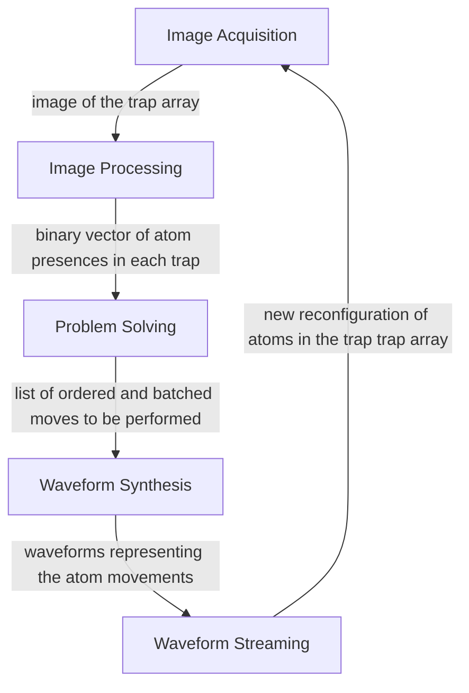

# LLRS
The Low-Latency Reconfiguration System (LLRS) is a closed-loop feedback control system that arranges and reconfigures atoms within an array of laser traps.

## System Outline 

The LLRS contains five submodules:

Each of these submodules is defined in [`modules/llrs-lib/modules`](https://github.com/TQT-RAAQS/LLRS/tree/main/modules/llrs-lib/modules).

## LLRS Directory 

```
LLRS
├─ .gitignore
├─ README.md
├─ LICENSE 
├─ resources
├─ configs
│  ├─ llrs 
│  ├─ awg
│  ├─ emccd 
│  ├─ fgc 
│  ├─ waveforms
│  ├─ waveform-power-safety
│  ├─ runtime-benchmarking 
│  └─ operational-benchmarking
├─ tools
│  ├─ setup-emccd.ipynb
│  ├─ generate-fake-psf.py 
│  ├─ psf-translator.py 
│  ├─ algorithm-animation-generator.ipynb
│  └─ benchmarks 
│     ├─ operational-benchmarking.ipynb
│     ├─ runtime-benchmarking.ipynb
│     ├─ image-acquisition-characterization.ipynb 
│     ├─ image-processing-characterization.ipynb 
│     └─ wfm-streaming-characterization.ipynb
└─ modules
    ├─ awg    [External Dependency]
    ├─ fgc    [External Dependency] 
    ├─ llrs-lib
    │  ├─ image-acquisition
    │  ├─ image-processing
    │  ├─ reconfiguration
    │  ├─ solver 
    │  ├─ waveform-synthesis
    │  ├─ waveform-streaming
    │  ├─ setup 
    │  ├─ collector 
    │  ├─ utility 
    │  └─ jsonwrapper 
    ├─ llcs 
    ├─ llrs-exe 
    ├─ operational-benchmarking
    ├─ runtime-benchmarking
    ├─ waveform-loader 
    ├─ hdf5-wrapper 
    ├─ movement-generator 
    └─ zmq-server 
```


## Installation & Setup

## Hardware Requirements

The LLRS requires the PC with the following hardware specifications to operate:

### Processors
- x86 64-bit CPU 
- Nvidia GPU with CUDA support
### Operating System
- Unix-based OS (Developed and tested on Ubuntu 18.04 LTS)  
### Peripherals
- Frame Grabber Card (FGC)
The Frame Grabber Card must be installed on a PCIe slot and connected to the EMCCD camera via a Camera Link cable. Additionally, the camera must be connected via a trigger cable to the AWG trigger port for image triggering.

- Arbitrary Waveform Generator (AWG)
The Arbitrary Waveform Generator card must be installed on a PCIe slot and its channels be connected to the AODs via a BNC cable.


## Software Requirements

Before usage, the following software must be installed and compiled to have a LLRS executable:

### Requirements

- GCC | The C++ compiler used to compile LLRS. Pre-installed on most GNU/Linux distro. | [Installation Guide](https://gcc.gnu.org/install/)
 
- NVCC CUDA Compiler | The Cuda compiler used to compile the LLRS. Requires a CUDA-enabled Nvidia GPU.| [Installation Guide](https://docs.nvidia.com/cuda/cuda-installation-guide-linux/index.html)
 
- Nvidia CUDA Toolkit | The CUDA library used only for the GPU features of the LLRS. | [Installation Guide](https://developer.nvidia.com/cuda-downloads)
 
- Meson Build System | The build system used to compile the project. | [Installation Guide](https://mesonbuild.com/Getting-meson.html)

- Python3 (Version 3.8 or newer) | Only required for benchmarking. | [Installation Guide](https://wiki.python.org/moin/BeginnersGuide/Download)
 
- Jupyter Notebook | Only required for benchmarking. | [Installation Guide](https://jupyter.org/install)
 
### Peripheral Drivers

- FGC
The LLRS uses ActiveSilicon FireBird Stick FGC and hence requires the installation of the ActiveSilicon SDK. It can be obtained from [ActiveSilicon](https://www.activesilicon.com/products/ActiveSDK-software-development-kit/), and must be then installed on the system. LLRS' build system will look for the SDK in the default installation path at `/usr/local/activesilicon`, but this can be changed in the corresponding [Meson file](modules/fgc/ActiveSDKv01.08.02/meson.build).

- AWG 
Similar to the FGC, the LLRS uses Spectrum Instrumentation's AWG cards and hence requires the installation of the Spectrum Instrumentation driver and SDKs. They can obtained from [Spectrum Instrumentation](https://spectrum-instrumentation.com/support/knowledgebase/software/How_to_compile_the_Linux_Kernel_Driver.php), and must be then installed on the system. LLRS' build system will look for the Spectrum library in the default installation paths.

- EMCCD

Although the LLRS doesn't directly interact with the EMCCD, but the EMCCD is required to be setup and waiting for hardware triggers before running the LLRS. The exact drivers and function calls that are necessary for this depends on your camera's make and model. An example for such precudure using the Andor's Python SDKs for the Andor iXon Ultra 888 can be found in the `tools/setup-emccd.ipynb` notebook.

### Build the LLRS
To compile the LLRS, follow these steps:
- Clone the repo on your local machine and navigate to the LLRS directory.
- In the terminal, execute the command `meson setup bin` in the LLRS directory.
- Navigate into the bin directory using `cd bin`.
- Execute `meson compile` to compile the LLRS.
- The compiled libraries and executables can be found under the `bin/modules` directory.

## Usage

###  Configure and Setup the Experiment 
There are several Yaml files stored in the `configs` directory which allow for configuration of the AWG, EMCCD camera, and FGC hardware settings.
There is also a configuration file for the LLRS which allows the user to define the problem for the LLRS to execute. Note that this configuration file includes fields for a PSF filename (`psf`) as well as CSV filenames (`coef_x` and `coef_y`) containing the alpha, nu, phi values of the AODs creating the trap array. These files must be generated by the user before the LLRS can run. 

The following configuration files must be stored in the following directories:
- PSF files must be stored in the `LLRS/resources/PSF/` 
- CSV files must be stored in the `LLRS/resources/coef/primary/` directory for `coef_x` and `LLRS/resources/coef/secondary/` directory for `coef_y`.
  
Note: The LLRS is set up to search the proper subdirectories for necessary support files. All resource files must be stored at the appropriate subdirectory, and only the file name must be provided in the field, not the full file path. 

### Run Experiment 
Run the LLRS executable placed at `bin/modules/llrs-exe/llrs-exe`. 
This causes the LLRS to begin waiting for an AWG trigger (jump from segment 0 to 1). The LLRS will wait for 60 seconds for a trigger, after which it will halt. Upon receiving an AWG trigger, the reconfiguration will execute. Following the termination of the program, it will output the success rate of the experiment.  


## Peripherals

### AWG
The Arbitrary Waveform Generator (AWG) is a versatile electronic instrument designed to produce various types of waveforms for use in a wide range of applications, such as signal testing, circuit testing, or trap manipulation and movement. 

In the context of the LLRS, the AWG is responsible for loading and streaming waveforms corresponding to the moves that are produced by the problem solving algorithms. 

The source code files and driver code for the AWG can be found in the github repository at [LLRS/modules/awg](https://github.com/TQT-RAAQS/LLRS/tree/main/modules/awg).

The Spectrum Hardware Manual and Software Driver Manual for can be found at the following link.
[AWG Manual](https://uofwaterloo-my.sharepoint.com/:b:/r/personal/acooperr_uwaterloo_ca/Documents/TQT-RAAQS/Projects%20(URAs)/Caltech/Scripts/createUniformTweezers/2018-05-10%20Create%20uniform%20arrays/createTweezers/SpcmMatlabDriver/m4i_m4x_66xx_manual_english.pdf?csf=1&web=1&e=6Qa8B3)


#### Loading and Streaming 

### FGC
The frame grabber card is a hardware device used in image processing and computer vision applications. It's designed to capture video frames from analog or digital video sources and convert them into digital format for further processing or storage on a computer.

The source code files and driver code for the FGC can be found in the github repository at [LLRS/modules/fgc](https://github.com/TQT-RAAQS/LLRS/tree/main/modules/fgc).

The FGC used by the LLRS is the , a specific model offered by Active Silicon and its various manuals can be accessed at the following links.

[FireBird System Manual](https://uofwaterloo-my.sharepoint.com/personal/acooperr_uwaterloo_ca/_layouts/15/onedrive.aspx?id=%2Fpersonal%2Facooperr%5Fuwaterloo%5Fca%2FDocuments%2FTQT%2DRAAQS%2FProjects%20%28URAs%29%2FEMCCD%20workstation%20%28Sailesh%29%2FActiveSDK%20v01%2E08%2E02%2Fdocumentation%2FFireBird%5FSystem%5FManual%2Epdf&parent=%2Fpersonal%2Facooperr%5Fuwaterloo%5Fca%2FDocuments%2FTQT%2DRAAQS%2FProjects%20%28URAs%29%2FEMCCD%20workstation%20%28Sailesh%29%2FActiveSDK%20v01%2E08%2E02%2Fdocumentation)

[PHX API Manual (Driver)](https://uofwaterloo-my.sharepoint.com/personal/acooperr_uwaterloo_ca/_layouts/15/onedrive.aspx?id=%2Fpersonal%2Facooperr%5Fuwaterloo%5Fca%2FDocuments%2FTQT%2DRAAQS%2FProjects%20%28URAs%29%2FEMCCD%20workstation%20%28Sailesh%29%2FActiveSDK%20v01%2E08%2E02%2Fdocumentation%2FPHX%5FAPI%5FManual%2Epdf&parent=%2Fpersonal%2Facooperr%5Fuwaterloo%5Fca%2FDocuments%2FTQT%2DRAAQS%2FProjects%20%28URAs%29%2FEMCCD%20workstation%20%28Sailesh%29%2FActiveSDK%20v01%2E08%2E02%2Fdocumentation)

### EMCCD
An EMCCD (Electron Multiplying Charge-Coupled Device) camera is a type of digital camera specifically designed for low-light imaging applications where high sensitivity and high-speed imaging are required. It is particularly useful in scientific research, microscopy, astronomy, and fluorescence imaging where capturing faint signals is crucial. The LLRS uses an EMCCD to take pictures of the trap array in order to identify which traps have atoms present.

The source code files and driver code for the EMCCD can be found in the github repository at [LLRS/modules/camera](https://github.com/TQT-RAAQS/LLRS/tree/main/modules/camera).


The model of EMCCD that is used by the LLRS is the Andor iXon Ultra 888. 
[Andor iXon Ultra 888 Hardware Manual](https://uofwaterloo-my.sharepoint.com/personal/acooperr_uwaterloo_ca/_layouts/15/onedrive.aspx?FolderCTID=0x0120004EEB1D30D2CDC344930DD3804F50A548&id=%2Fpersonal%2Facooperr%5Fuwaterloo%5Fca%2FDocuments%2FTQT%2DRAAQS%2FInstruments%2FCameras%2FAndor%20iXon%20Ultra%20888%2FiXon%20Ultra%20888%20Hardware%20Guide%201%2E0%2Epdf&parent=%2Fpersonal%2Facooperr%5Fuwaterloo%5Fca%2FDocuments%2FTQT%2DRAAQS%2FInstruments%2FCameras%2FAndor%20iXon%20Ultra%20888)

[Software Developement Kit](https://uofwaterloo-my.sharepoint.com/personal/acooperr_uwaterloo_ca/_layouts/15/onedrive.aspx?FolderCTID=0x0120004EEB1D30D2CDC344930DD3804F50A548&id=%2Fpersonal%2Facooperr%5Fuwaterloo%5Fca%2FDocuments%2FTQT%2DRAAQS%2FInstruments%2FCameras%2FAndor%20iXon%20Ultra%20888%2FSoftware%20Development%20Kit%2Epdf&parent=%2Fpersonal%2Facooperr%5Fuwaterloo%5Fca%2FDocuments%2FTQT%2DRAAQS%2FInstruments%2FCameras%2FAndor%20iXon%20Ultra%20888)

The sensor that is present in the EMCCD is the CCD201-20.
[EMCCD Sensor Data Sheet](https://uofwaterloo-my.sharepoint.com/personal/acooperr_uwaterloo_ca/_layouts/15/onedrive.aspx?FolderCTID=0x0120004EEB1D30D2CDC344930DD3804F50A548&id=%2Fpersonal%2Facooperr%5Fuwaterloo%5Fca%2FDocuments%2FTQT%2DRAAQS%2FInstruments%2FCameras%2FAndor%20iXon%20Ultra%20888%2FCCD201%2D20%20Sensor%20Data%20Sheet%2Epdf&parent=%2Fpersonal%2Facooperr%5Fuwaterloo%5Fca%2FDocuments%2FTQT%2DRAAQS%2FInstruments%2FCameras%2FAndor%20iXon%20Ultra%20888)


# Configuration of the AWG Power Calculator

We need a way of predicting the power streamed by the AWG (and potentially amplified by an electronic amplifier) before supplying it to the target device, e.g. AOMs or AODs. To perform this calculation and to ensure the safety of the device, the following information must be provided. This information can be found by 'callibrating' the AWG.

To do this, follow the following procedure.

1. Keep track of the nominal peak-to-peak voltage configured for the AWG channel you wish to callibrate at `config/awg/awg.yml`.

2. Connect the AWG output to the Spectrum Analyzer. If you wish to use an electronic amplifier in the final setup, you can connect the AWG output to the amplifier and connect the amplifier output to the Spectrum Analyzer instead.

3. Stream a monotonic waveform at some frequency with the maximum amplitude possible. 

4. Fill out the config file at `configs/waveform-power-calculator/config.yml`

Note that this calculator assumes the gain of the AWG/amplifiers for different frequencies is identical.

# Waveform Synthesis - Derivations
### Narrator: SK

In this document we describe how waveforms move atoms from one trap to another. We first briefly describe how static waveforms are synthesizes; afterwards, we describe how _transition waveforms_ can be synthesized. Finally, we provide explicit forms of specific examples of transition waveforms.

**Transition waveforms** are waveforms that, over some duration $T$, transition the waveform amplitude, frequency, and overall phase. Examples of these waveforms are extraction waveforms (dynamic traps picking up atoms from a static trap), implantation waveforms (dynamic traps planting the atoms into a static trap), and displacement waveforms (dynamic traps moving a trap from one site to another).

## Static Waveforms

To each trap is associated a waveform responsible for holding the atom trapped in its place. The waveforms are defined by three variables: $(\alpha, \nu, \phi)$, where $\alpha$ is the amplitude of the static waveform associated with the trap, $\nu$ is the associated frequency, and $\phi$ is the overall phase.

The static waveform is thus defined as:

$$ f(t) = \alpha \sin(2\pi \nu t + \phi) $$

## Transition Waveforms

Each transition waveform is responsible for:
1) Transitioning the amplitude of the waveform
2) Transitioning the frequency of the waveform (chirping the frequency)
3) Transitioning the overall phase of the waveform

In otherwords, the transition waveform is a waveform that _smoothly_ transitions from a waveform $(\alpha_1, \nu_1, \phi_1)$ to $(\alpha_2, \nu_2, \phi_2)$. We will describe mathematically what _smooth_ means in this context.

A general transition waveform is thus of the following format:

$$ f(t) = \alpha(t) \sin(\phi(t)) , 0 \leq t \leq T $$

The transition waveform must satisfy the following conditions.

1) The function $\alpha(t)$ satisfies:
$$ \alpha(0) = \alpha_1, \alpha( T)=\alpha_2$$
2) The derivate of the $\alpha(t)$ function satisfies:
$$ \alpha'(0) = 0, \alpha'( T)=0$$
3) The function $\nu(t)$ satisfies ($k \in \mathbb{Z}$ is arbitrary):
$$ \phi(0) = \phi_1, \phi( T)=2\pi k + \phi_2$$
4) The derivate of the $\phi(t)$ function satisfies:
$$ \phi'(0) = 2\pi \nu_0, \phi'(T)=2\pi \nu_1$$
5) The second derivate of the $\phi(t)$ function satisfies:
$$ \phi''(0) = 0, \phi''(T)=0$$

All the equality signs above can be relaxed by allowing some error tolerance. Some waveforms, by construct, cannot satisfy all the conditions above simultaneously. Therefore, relaxing the conditions above is sometimes a necessity.

## Tanh Transition Waveforms

**Parameters**
$$ v_{\text{max}}\text{: Maximum velocity of the atom/Interatomic Distance} $$

**Waveform Description**

$$ \alpha(t) = \dfrac{\alpha_1 + \alpha_2}{2} + \dfrac{\alpha_2 - \alpha_1}{2} \tanh\left(2v_{\text{max}} \left[t - \dfrac{T}{2}\right]\right) $$

$$ \nu(t) = \dfrac{\nu_1 + \nu_2}{2} + \dfrac{\nu_2 - \nu_1}{2} \tanh\left(2v_{\text{max}} \left[t - \dfrac{T}{2}\right]\right) $$

**Equations**

$$ f(t) = \alpha(t) \sin\left(\phi_1 + 2\pi \tilde{\phi}(t) + \dfrac{\Delta \phi \cdot t}{T}\right) $$

Where:

$$ \alpha(t) = \dfrac{\alpha_1 + \alpha_2}{2} + \dfrac{\alpha_2 - \alpha_1}{2} \tanh\left(2v_{\text{max}}\left[t-\dfrac{T}{2}\right]\right) $$

$$ \tilde{\phi}(t) = \dfrac{\nu_1 + \nu_2}{2}t + \dfrac{\nu_2 - \nu_1}{4v_{\text{max}}} \log\left(\cosh\left(2v_{\text{max}}\left[t - \dfrac{T}{2}\right]\right)\right) - \dfrac{\nu_2 - \nu_1}{4v_{\text{max}}} \log\left(\cosh\left(v_{\text{max}}T\right)\right)$$

$$ \Delta \phi = \begin{cases} \delta \phi & |\delta \phi| < \pi \\ \delta \phi - \text{sgn}(\delta \phi) \cdot 2\pi & |\delta \phi| \geq \pi \end{cases} $$

$$ \delta \phi = \phi_2 - \phi_1\ \text{mod}\ 2\pi $$

**Conditions**
* $v_{\text{max}}$ must be positive.
* $v_{\text{max}} T \gg 1$ must be true so  that the conditions on transition waveforms outlined in the previous section are _approximately_ correct. In particular, when $v_{\text{max}} T < \text{atanh}(0.98)$, there will be a jump in the amplitude/frequency by more than 1% of the total transition range (i.e. the atom will make a jump larger than 1% of the interatomic distance).

**Comments**
None

## Erf Transition Waveforms

**Parameters**
$$ v_{\text{max}}\text{: Maximum velocity of the atom/Interatomic Distance} $$

**Waveform Description**

$$ \alpha(t) = \dfrac{\alpha_1 + \alpha_2}{2} + \dfrac{\alpha_2 - \alpha_1}{2} \text{erf}\left(\sqrt{\pi}v_{\text{max}} \left[t - \dfrac{T}{2}\right]\right) $$

$$ \nu(t) = \dfrac{\nu_1 + \nu_2}{2} + \dfrac{\nu_2 - \nu_1}{2} \text{erf}\left(\sqrt{\pi}v_{\text{max}} \left[t - \dfrac{T}{2}\right]\right) $$

**Equations**

$$ f(t) = \alpha(t) \sin\left(\phi_1 + 2\pi \tilde{\phi}(t) + \dfrac{\Delta \phi \cdot t}{T}\right) $$

Where:

$$ \alpha(t) = \dfrac{\alpha_1 + \alpha_2}{2} + \dfrac{\alpha_2 - \alpha_1}{2} \text{erf}\left(\sqrt{\pi}v_{\text{max}}\left[t-\dfrac{T}{2}\right]\right) $$

$$ \tilde{\phi}(t) = \dfrac{\nu_1 + \nu_2}{2}t + \dfrac{\nu_2 - \nu_1}{2\sqrt{\pi} v_{\text{max}}}\left[\sqrt{\pi}v_{\text{max}} \left(\bar{t} - \dfrac{T}{2}\right) \text{erf}\left(\sqrt{\pi} v_{\text{max}} \left(\bar{t} - \dfrac{T}{2}\right)\right) + \dfrac{\exp\left(-\left\lbrace\sqrt{\pi}v_{\text{max}}\left(\bar{t}-\dfrac{T}{2}\right)\right\rbrace^2\right)}{\sqrt{\pi}}\right]^{\bar{t} = t}_{\bar{t} = 0} $$

$$ \Delta \phi = \begin{cases} \delta \phi & |\delta \phi| < \pi \\ \delta \phi - \text{sgn}(\delta \phi) \cdot 2\pi & |\delta \phi| \geq \pi \end{cases} $$

$$ \delta \phi = \phi_2 - \phi_1 \ \text{mod}\ 2\pi $$

**Conditions**
* $v_{\text{max}}$ must be positive.
* $v_{\text{max}} T \gg 1$ must be true so  that the conditions on transition waveforms outlined in the previous section are _approximately_ correct. In particular, when $v_{\text{max}} T < 3.29$, there will be a jump in the amplitude/frequency by more than 1% of the total transition range (i.e. the atom will make a jump larger than 1% of the interatomic distance).

**Comments**
None

## Spline Transition Waveform

**Parameters**
None

**Waveform Description**

$$ \alpha(t) = a_1t^3 + b_1t^2 + c_1t + d_1 $$

$$ \nu(t) = a_2t^3 + b_2t^2 + c_2t + d_2 $$

Where the coefficients are chosen such that the condiions of a transition waveform are satisfied exactly.

**Equations**

$$ f(t) = \alpha(t) \sin\left(\phi_1 + 2\pi \tilde{\phi}(t) + \dfrac{\Delta \phi \cdot t}{T}\right) $$

Where:

$$ \alpha(t) = -2(\alpha_2 - \alpha_1) \left(\dfrac{t}{T}\right)^3 + 3(\alpha_2-\alpha_1)\left(\dfrac{t}{T}\right)^2 + \alpha_1 $$

$$ \tilde{\phi}(t) = \dfrac{-(\nu_2 - \nu_1)}{2T^3} t^4 + \dfrac{\nu_2 - \nu_1}{T^2} t^3 + \nu_1 t $$

$$ \Delta \phi = \begin{cases} \delta \phi & |\delta \phi| < \pi \\ \delta \phi - \text{sgn}(\delta \phi) \cdot 2\pi & |\delta \phi| \geq \pi \end{cases} $$

$$ \delta \phi = \phi_2 - \phi_1 - 2\pi \tilde{\phi}(T)\ \text{mod}\ 2\pi $$

**Conditions**
None

**Comments**
The maximum velocity ratio to the interatomic distance of the atom, i.e. $v_{\text{max}}$, achieved by the atom occurs at $t = \dfrac{T}{2}$ where:

$$ v_{\text{max}} = \dfrac{3}{2T(\nu_2 - \nu_1)} $$
