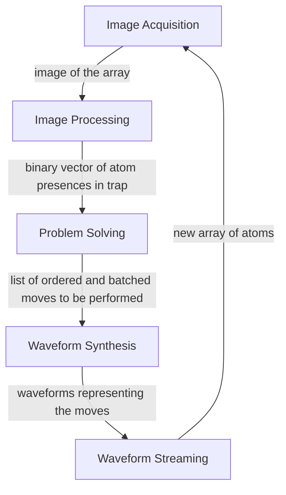

# LLRS Outline
The low-latency reconfiguration system (LLRS) is a closed-loop feedback control system that arranges and reconfigures atoms within an array of laser traps.
 
The LLRS contains five submodules:

Each of these submodules is defined in [`modules/llrs-lib/modules`](https://github.com/TQT-RAAQS/LLRS/tree/main/modules/llrs-lib).

## Requisites ##
 
- GCC | [Installation Guide](https://gcc.gnu.org/install/)
 
- NVCC CUDA Compiler | [Installation Guide](https://docs.nvidia.com/cuda/cuda-installation-guide-linux/index.html)
 
- Python3 (Version 3.8 or newer) | [Installation Guide](https://wiki.python.org/moin/BeginnersGuide/Download)
 
- Meson Build System | [Installation Guide](https://mesonbuild.com/Getting-meson.html)
 
- Jupyter Notebook (only required for benchmarking) | [Installation Guide](https://jupyter.org/install)
 
## LLRS Directory ##
```
LLRS
├─ .gitignore
├─ README.md
├─ LICENSE 
├─ resources
├─ configs
│  ├─ llrs 
│  ├─ operational-benchmarking 
│  ├─ runtime-benchmarking 
│  ├─ awg 
│  └─ fgc 
├─ tools
│  └─ benchmarks 
│     ├─ operational-benchmarking 
│     └─ runtime-benchmarking 
└─ modules
    ├─ awg 
    ├─ fgc 
    ├─ llrs-lib
    │  ├─ image-acquisition
    │  ├─ image-processing
    │  ├─ reconfiguration
    │  ├─ solver 
    │  ├─ waveform-synthesis
    │  ├─ waveform-streaming
    │  ├─ setup 
    │  ├─ collector 
    │  ├─ utility 
    │  └─ jsonwrapper 
    ├─ llcs 
    │  └─ [PLACEHOLDER]
    ├─ llrs-exe
    │  └─ [PLACEHOLDER]
    ├─ tests
    │  └─ [PLACEHOLDER]
    ├─ operational-benchmarking
    └─ runtime-benchmarking
       └─ [PLACEHOLDER]
```
