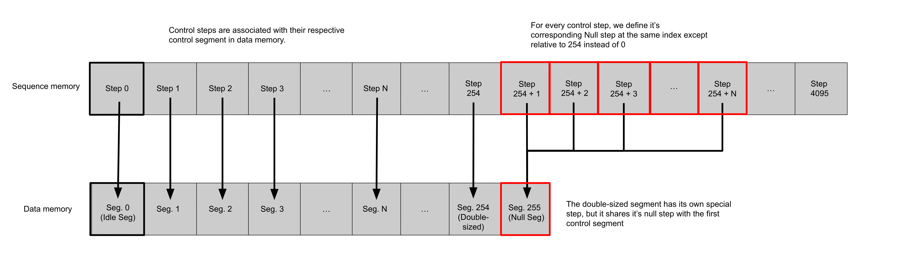
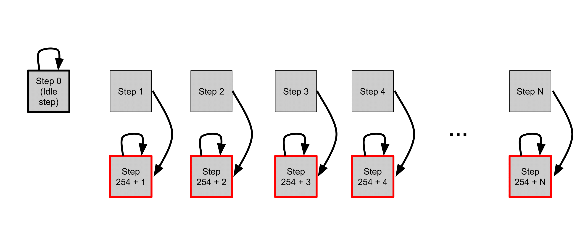
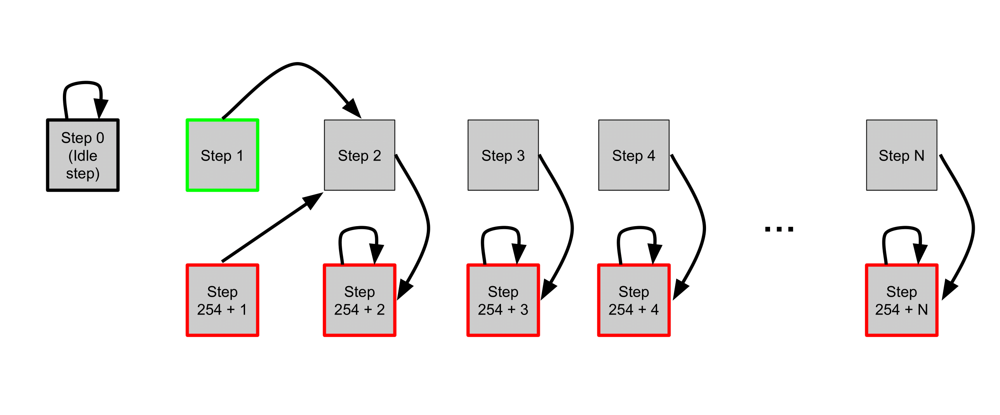
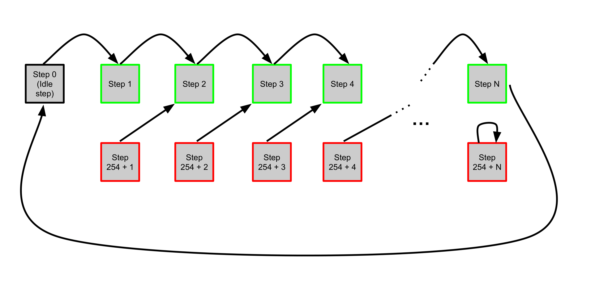

# AWG
The Automatic Waveform Generator (AWG) is a versatile electronic instrument designed to produce various types of waveforms for use in a wide range of applications, such as signal testing, circuit testing, or trap manipulation and movement. 

In the context of the LLRS, the AWG is responsible for loading and streaming waveforms corresponding to the moves that are produced by the problem solving algorithms. 

The source code files and driver code for the AWG can be found in the github repository at [LLRS/modules/awg](https://github.com/TQT-RAAQS/LLRS/tree/main/modules/awg).
The Spectrum Hardware Manual and Software Driver Manual for can be found at the link below.
[AWG Manual](https://uofwaterloo-my.sharepoint.com/:b:/r/personal/acooperr_uwaterloo_ca/Documents/TQT-RAAQS/Projects%20(URAs)/Caltech/Scripts/createUniformTweezers/2018-05-10%20Create%20uniform%20arrays/createTweezers/SpcmMatlabDriver/m4i_m4x_66xx_manual_english.pdf?csf=1&web=1&e=6Qa8B3)

# Loading and Streaming 
The AWG features sequence memory and data memory.
The data memory is the installed on-board memory of the card and can be segmented into a user defined number of segments. The data memory is responsible for storing the waveforms, and we define each segment of the data memory to be 32 waveforms in length. 
The sequence memory defines a number of data loop steps that are executed step by step. Each step in the sequence memory contains a pointer to a segment of data memory which is to be played, a number indicating how many times to play that data memory segment, and a pointer to the next loop step in sequence memory to proceed to when the current step is done.

  

For the LLRS the AWG performs concurrent loading and streaming of waveforms in order to minimize the time of execution for the LLRS. Two segments of waveforms are loaded into the data memory and then the sequence memory begins, executing the streaming of waveforms from the data memory as further segments of the memory are loadedd concurrently.
The initial step of sequence memory is referred to as the idle step, and is entered when the AWG recieves a trigger indicating that the LLRS is beginning execution. The idle step points to itself as the next step, and thus it loops on itself while the inital loading of the data memory occurs. The sequence memory is partitioned into pairs with each step pointing to a corresponding null step which is located in the back half of the sequence memory and points to the null segment in data memory. As the data memory is loaded with waveforms, the sequence memory is altered so that each step points to the next one instead of its corresponding null. This is done to ensure that if playback of sequence memory ever outpaces and catches up to the loading of sequence memory, then nulls are reached by the playback head instead of empty data memory. 

The following diagrams show the sequence memory of the AWG for initialization, single segment of uploaded waveforms, and final segment of uploaded waveforms respectively.

  

  

  

