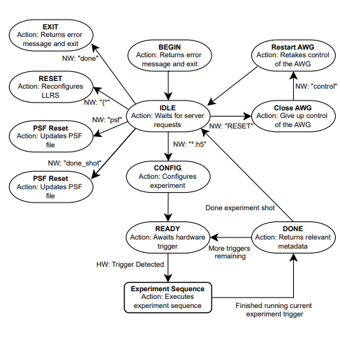

# Low-Latency Control System Summary

The Low-Latency Control System is the system responsible for running the LLRS experiment shots. The LLCS connects to the workstation via a ZMQ server and communicates through the server to configure hardware, program the experimental shot sequence, and to return relevant experimental metadata. 

# General Workflow:

<p align="center">
  
</p>

The LLCS will begin in the BEGIN state, where the LLRS object is created and static waveforms are streamed to the AWG. Upon completion, the LLCS will automatically transition to the idle state where it will wait for server calls from the workstation. The server calls can configure/reconfigure various experiment modules and experiment sequence, transition the LLCS to the READY state, where it will wait for a hardware trigger to begin the experimental shot, and exit the LLCS. Each trigger will execute a series of experiment modules, configured by the workstation. Upon finishing all triggers in the shot, a JSON file containing relevant experimental metadata will be sent to the workstation and the LLCS will return to the IDLE state. 


# Usage Instructions:

### 1. Navigate to the low-latency-LLCS directory. 
```Bash
cd ~/Experiment/experiment/modules/low-latency-LLCS
```

### 2. Set the appropiate Shell Variables:
```Bash
export CPATH="$CPATH:/usr/include/hdf5/serial/:/usr/include/hdf5"
export LD_LIBRARY_PATH="$LD_LIBRARY_PATH:/home/$USER/Experiment/experiment/modules/low-latency-LLCS/lib:/home/$USER/Experiment/experiment/instruments/awg_cpp/lib:/home/$USER/Experiment/experiment/instruments/fgc_cpp/lib"
```

### 3. Run the python script to compile all relevant modules
```Bash
./build.py
```
If there is an error message regarding denied permission, simply add the execution permission to the file, and run the script again.
```Bash
chmod a+x build.py
```

### 4. Run the LLCS
```Bash
./bin/main
```

### 5. Wait for the message "LLCS:: IDLE state". In the IDLE state you can send 5 server requests.

 ```*.h5```<p></p>
        - The request string can be an h5 filepath containing the configuration data <p></p>
        - Configures the AWG, "easy to configure" properties of the LLRS, and the experimental shot sequence<p></p>
        - Automatically transitions to the READY state upon completion

 ```RESET```<p></p>
        - Closes connection to the LLCS for another device to take over<p></p>
        - Waits for the "control" request from the server to retake control over the AWG<p></p>
        - IMPORTANT: The user must follow up with sending "control" before proceeding with any other LLCS actions<p></p>
        - Automatically transition back to IDLE

  ```psf```<p></p>
        - Runs the psf_translator python script, which updates psf file<p></p>
        - Automatically transitions back to the IDLE state<p></p>
        - IMPORTANT: The user should send a .h5 filepath when the LLCS is back in IDLE in order to update the LLRS with the new psf file

 ```{ *```<p></p>
        - The request string is the contents of a JSON file containing the LLRS configuration file, beginning with "{"<p></p>
        - Reconfigures the LLRS and it's waveform table with the new configuration<p></p>
        - This will take a few minutes to complete, and will automatically transition to IDLE upon completion

```send_data```<p></p>
        - Return a filepath to the workstation for the metadata file of the most recent shot
    
 ```done```<p></p>
        - The LLCS program will terminate gracefully


### 6. After sending a .h5 filepath while in the IDLE state, the LLCS will transition to READY. Wait for the message "Awaiting Hardware Trigger...". The user must send a hardware trigger via the workstation to run each experiment sequence. This message will reappear every time there are more triggers left in the experimental shot. 


### 7. After the experimental shot is completed, the LLCS will transition back to IDLE. Repeat steps 4-5.

